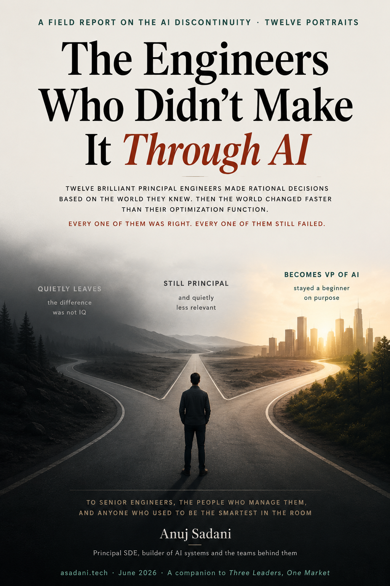

# The Engineers Who Didn't Make It Through AI

<p align="center">
  
</p>

<p align="center">
  <strong><a href="https://tech.anujsadani.in/the-failed-engineer/">Read online</a></strong>
  &nbsp;&middot;&nbsp;
  <strong><a href="the-failed-engineer.pdf">Download the PDF</a></strong>
  &nbsp;&middot;&nbsp;
  <a href="https://ko-fi.com/s/70b71a3671">Typeset edition on Ko-fi</a>
</p>

---

Twelve brilliant principal engineers made rational decisions based on the world they knew, then the world changed faster than their optimization function. The Craftsman, the Skeptic, the Lone Expert, the Builder: twelve failure modes of senior technical leadership during a discontinuity, braided into one argument. A companion to Three Leaders, One Market, turned on people instead of firms. No villains, only people who optimized for a reality that stopped existing.

## What's here

| File | What it is |
|---|---|
| [`the-failed-engineer.pdf`](the-failed-engineer.pdf) | The typeset edition, 18pp. |
| [`index.html`](https://tech.anujsadani.in/the-failed-engineer/) | The full text as one self-contained page. Read it online rather than as source. |
| `book.html.in` | The manuscript. Built by [book-forge](https://github.com/asadani/book-forge). |
| `meta.yaml` | Build configuration: cover, licence, front and back matter. |

## How it is built

The front matter and the closing author page are generated by
[book-forge](https://github.com/asadani/book-forge) from one shared source, so
they are identical across every book on the shelf:

```
bf inject     render the matter into book.html.in
bf build      html -> headless Chrome -> folio-stamped, self-audited PDF
```

## Licence

Copyright &copy; 2026 Anuj Sadani. All rights reserved.

Quote it in a review, in criticism, or in scholarship with attribution — that
needs no permission from anyone. For anything further, including translation,
reprinting or commercial use, please ask.

Written by **Anuj Sadani** — [anujsadani.in](https://anujsadani.in/) ·
[tech.anujsadani.in](https://tech.anujsadani.in/) ·
[ORCID 0009-0001-0124-3181](https://orcid.org/0009-0001-0124-3181)
